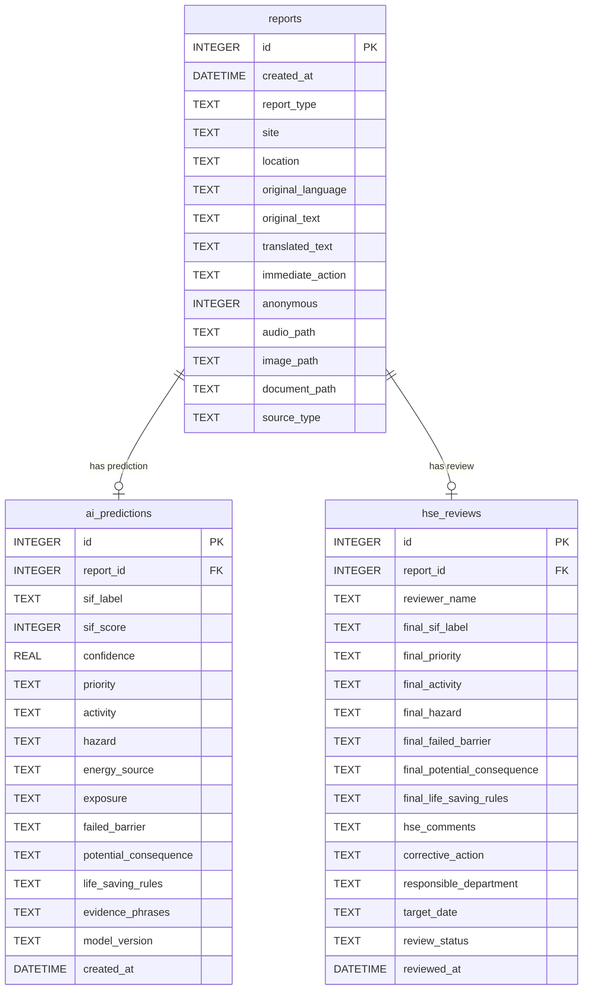

# Implementation Plan - SIF-Insight

SIF-Insight is a decision-support prototype for Oil India Limited (OIL) to identify Serious Injury or Fatality (SIF) precursors from safety reports (Unsafe Acts, Unsafe Conditions, Near Misses, Incidents). It is designed to work with fallback mechanisms if local heavy models (Whisper, IndicTrans2, sentence-transformers) are unavailable, and runs without any paid cloud APIs.

## User Review Required

> [!IMPORTANT]
> **Safety Warning & Disclaimer Display:**
> - The application will clearly display: *“AI results are preliminary and require HSE validation.”* on all prediction-facing pages.
> - The application will also show: *“Demonstration dataset only. Production deployment requires OIL-approved historical data, taxonomy and HSE-validated labels.”*
> - If a worker selects "Yes" for "Is anyone in immediate danger?", a prominent alert will display: *“If there is immediate danger, follow OIL’s emergency procedure and inform the supervisor/control room immediately. AI processing must not delay emergency response.”*

> [!NOTE]
> **No Mandatory API Keys:**
> - All heavy services (Whisper, Translation, Embeddings) will run locally if available, but will gracefully degrade to a **Demonstration/Fallback mode** with manual inputs or rule-based processing if the local models are missing.

---

## Proposed Project Structure

We will create a standard, clean Python and Streamlit project structure:
```text
SIF-Insight/
├── app.py                     # Main application landing page (Home / Overview)
├── requirements.txt           # Main python dependencies
├── .gitignore                 # Standard Python gitignore
├── .env.example               # Example env configuration
├── README.md                  # Comprehensive project documentation
├── data/
│   ├── life_saving_rules.json # IOGP taxonomy and keywords
│   └── demo_reports.csv       # Generated synthetic reports (80+ records)
├── database/
│   ├── __init__.py
│   └── db.py                  # SQLite database access layer
├── services/
│   ├── __init__.py
│   ├── classifier.py          # 3-layer hybrid SIF classifier
│   ├── text_extraction.py     # DOCX, PDF, CSV, XLSX, OCR text extractor
│   ├── stt.py                 # Whisper-based STT with audio fallback
│   ├── translation.py         # IndicTrans2 translator with mock local fallback
│   └── similar_search.py      # sentence-transformers similar report search (or TF-IDF fallback)
├── pages/
│   ├── 1_Worker_Report_Submission.py  # Page 2
│   ├── 2_HSE_Review_Queue.py          # Page 3
│   ├── 3_Report_Explorer.py           # Page 4
│   ├── 4_Analytics_Dashboard.py       # Page 5
│   └── 5_Taxonomy_and_Model_Info.py   # Page 6
├── scripts/
│   └── create_demo_data.py    # Script to create data/demo_reports.csv and train ML classifier
└── tests/
    └── test_sif_insight.py    # Pytest unit and integration tests (15+ test cases)
```

---

## Database Schema Design

We will use SQLite with three tables. Text-based fields representing lists will be saved as JSON strings (e.g., `life_saving_rules` and `evidence_phrases`).



---

## SIF Classification Design

We will implement a hybrid explainable pipeline running in 3 layers:

### Layer 1: Rule-Based Safety Engine
- Extracts text matching specific phrases/concepts for safety categories:
  - *Energy isolation, Confined space, Hot work, Line of fire, Working at height, Driving, Bypassing safety controls, Safe mechanical lifting, Work authorization*.
- Handles **negations** using standard regex matching patterns:
  - If a keyword (e.g. `gas testing`) is preceded or followed within a short window by negation words (`no`, `not`, `without`, `failed`, `missing`, `never`, `bypassed`, `incomplete`), it is counted as a failed barrier.
  - If there is no negation (e.g. `gas testing completed`), it is categorized as a completed barrier and does not add to the SIF threat score.

### Layer 2: Explainable Scoring
We assign risk points based on the extracted rule-based triggers and sentence tokens:
- High-energy hazard (welding, electricity, pressure, crane): **+2**
- Person directly exposed (entered, standing under, working at height): **+3**
- Barrier missing or failed (no permit, isolation failed, no harness): **+3**
- Credible fatal consequence (electrocution, crushing, fall): **+2**
- Multiple people exposed (crew, workers, team): **+1**
- Near-miss or incident context (sparks, dropped, fell): **+1**

**Score thresholds:**
- **0–3**: Non-SIF-potential
- **4–6**: Review Required
- **7 or higher**: SIF-potential

### Layer 3: Machine Learning Model
- Trains a `TfidfVectorizer` paired with a `LogisticRegression` classifier.
- If the local trained ML model exists, it calculates probability as the classification confidence.
- If it does not exist or has low reliability, it defaults to the rule-based scoring classification and indicates `"Rule-engine fallback"` as the classifier mode.

---

## Fallback Mechanisms

| Service | Preferred local model | Fallback behavior |
| :--- | :--- | :--- |
| **Speech-To-Text** | Local `faster-whisper` or `whisper` | Save the file, flag "Transcription unavailable", display user text-input/selection for demo transcription |
| **Translation** | Local `IndicTrans2` or `marian-mt` | Flag "Translation unavailable", analyze as English, or allow user to supply manual English translation |
| **Similar Search** | Local `sentence-transformers` | Falls back to **TF-IDF + Cosine Similarity** using scikit-learn |
| **OCR** | Local `pytesseract` | Displays warning "OCR not installed/configured", lets user upload files but skips OCR extraction (extracting native text if PDF/DOCX) |

---

## Verification Plan

### Automated Tests (`pytest tests/`)
We will create `tests/test_sif_insight.py` testing:
1. Report creation and insertion/retrieval in SQLite.
2. Negation handling (e.g., "gas testing completed" vs "no gas testing done").
3. Detection of Energy Isolation, Confined Space, Hot Work, Line of Fire.
4. SIF scoring logic and classification thresholds.
5. Multi-label Life-Saving Rule output.
6. Site SIF density formula output: `(SIF / total) * 100`.
7. Empty inputs & unsupported file type gracefully rejected.
8. Saving HSE review corrections.
9. End-to-end flow: Submission -> DB save -> Classification -> HSE correction updates.

### Manual Verification
1. Run `python scripts/create_demo_data.py` to seed reports and train classifier.
2. Start the Streamlit application `streamlit run app.py`.
3. Verify worker reporting with standard text report:
   *"During maintenance of a crude oil pump, electrical isolation was not verified. The technician started removing the coupling guard while the pump was still connected to the power supply."*
4. Verify HSE queue, review page, editing, and closing.
5. Verify Analytics dashboard, charts, heatmap, and CSV export.
